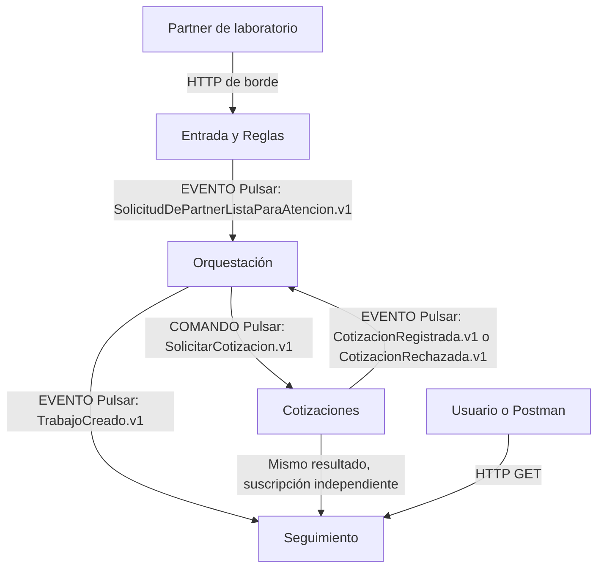
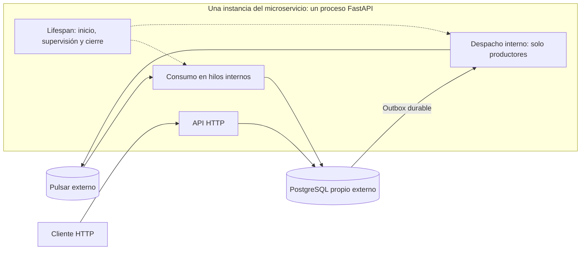

# Planes de los otros microservicios — Entrega 4

Actualizado: 2026-09-13, hora de Bogotá. **Nicolás aprobó reemplazar Scoring por Seguimiento de Trabajos y retirar los despliegues separados de consumo/despacho. Implementación y experimentos pendientes.**

Esta carpeta organiza Orquestación, Cotizaciones y Seguimiento sin reconstruir Entrada. Conserva las lecciones de las nueve conversaciones y retira la preparación de trabajos ejecutados y el cierre de laboratorio. No hace falta completar todo el negocio para probar el recorrido.

## Por dónde empezar

1. Leer [decisiones y alcance](00-decisiones-y-alcance.md).
2. Usar [contratos y datos](01-contratos-y-datos.md) para integrar productores y consumidores.
3. Seguir los ocho planes numerados de cada servicio:

| Responsable | Plan | Primer resultado |
|---|---|---|
| Nicolás | [Entrada existente](../entrada-solicitudes-partner/docs/plans/README.md) | Solicitud lista y contrato vigente |
| Compañero por asignar | [Orquestación](orquestacion/README.md) | Trabajo, evento TrabajoCreado y comando SolicitarCotizacion |
| Compañero por asignar | [Cotizaciones](cotizaciones/README.md) | Propuesta/rechazo persistido y evento de resultado |
| Compañero por asignar | [Seguimiento](seguimiento/README.md) | Vista persistente por trabajo, consulta y lector v1/v2 |

4. Aplicar la [base común](02-base-de-implementacion.md), sin crear una biblioteca compartida.
5. Integrar y medir según [experimentos y reparto](03-integracion-experimentos-y-entrega.md).
6. Consultar [fuentes y lecciones](04-fuentes-y-lecciones.md).

## Recorrido automático

Cotizaciones publica cada resultado una vez; Pulsar entrega copias a las suscripciones de Orquestación y Seguimiento. Las réplicas de cada efecto comparten su suscripción. Cada servicio conserva su base propia. Una única solicitud inicial pone en marcha el recorrido; los catálogos/políticas sintéticos se cargan durante la preparación normal del laboratorio, sin ejecutar pasos manuales por trabajo.

Seguimiento es un servicio de consulta con proyección propia, **no un nuevo dominio empresarial ni el dueño del estado del Trabajo**. Permite observar la creación y el resultado de cotización. No demuestra que Orquestación ya aplicó ese resultado: ambos consumidores convergen por separado.

## Ejecución dentro de cada servicio

La API y los bucles de mensajería se inician y cierran mediante `lifespan` en el mismo proceso FastAPI. Las operaciones síncronas usan hilos administrados para mantener disponible HTTP. Orquestación y Cotizaciones incluyen despacho de outbox; Seguimiento solo consume y consulta. La unidad de despliegue y escala es el servicio completo.

Cloud Run: un Service por microservicio, CPU/facturación por instancia y capacidad habitual 1. Para E8 se detiene Cotizaciones completo; para E4 se comparan 1/2/4 instancias completas. La [base común](02-base-de-implementacion.md) concreta lifecycle y pruebas, y el [protocolo de integración](03-integracion-experimentos-y-entrega.md) documenta plataforma y operaciones. Entrada conserva su implementación actual: adaptar su composición es un pendiente explícito para el despliegue uniforme.

## Alcance de los escenarios

- **E3 reformulado:** evolucionar CotizacionRegistrada con `duracion_estimada_minutos` opcional; Seguimiento muestra el dato y los lectores antiguos siguen operativos. La ficha original usaba TrabajoCerrado/Scoring: hay que actualizarla y justificar el cambio, no afirmar cobertura literal de aquella ficha.
- **E4:** conserva 4× carga y mide también demora de la vista. Persisten los límites de 48 horas y la brecha de marketplace del 10 %.
- **E8:** Entrada sigue siendo el artefacto evaluado y Cotizaciones el servicio que falla. Consultar pendientes y observar recuperación son comprobaciones adicionales, no sustituyen verificar recepción durable.

Los planes definen tareas, archivos, pruebas y criterios de cierre. No se modificó Entrada ni se implementaron/desplegaron servicios. La evidencia histórica de 253 pruebas de Entrada no es una corrida de esta actualización.
